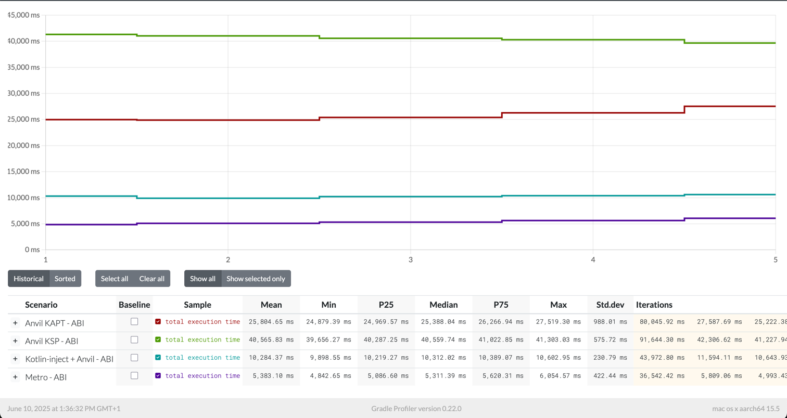
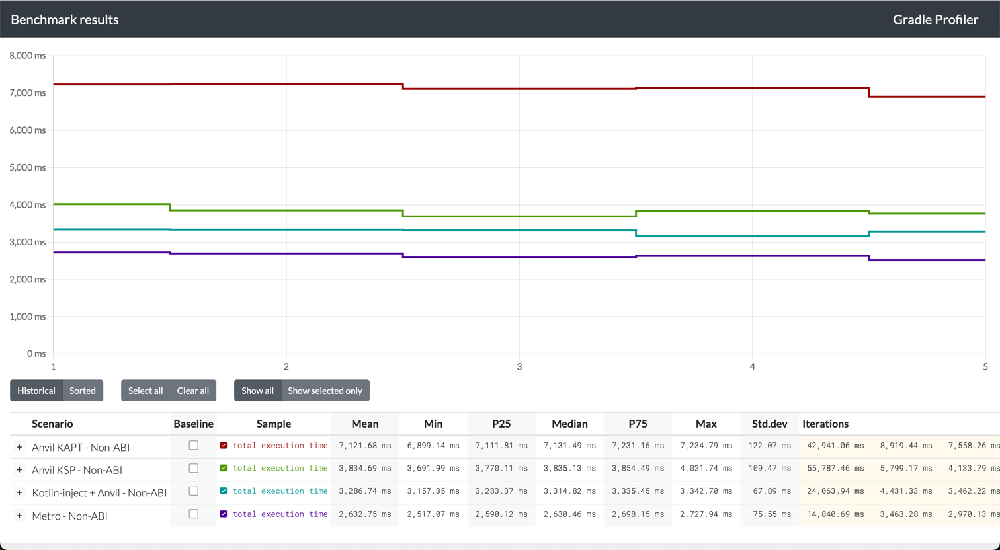

# Performance

Metro strives to be a performant solution with minimal overhead at build-time and generating fast, efficient code at runtime. As build performance is the primary consideration for most developers considering this, most of this doc will be focused on that.

## Build Performance

Metro's compiler plugin is designed to be _fast_. Running as a compiler plugin allows it to:
- Avoid generating new sources that need to be compiled
- Avoid running KSP/KAPT
- Generate IR that lowers directly into target platforms
- Hook directly into kotlinc's IC APIs.

**In a straightforward migration, it improves ABI-changing build performance from 30-70%.**

### Benchmarking

To benchmark against Anvil-KSP, Dagger (KSP or KAPT), and Kotlin-Inject (+ Anvil), there is a [benchmark](https://github.com/ZacSweers/metro/tree/main/benchmark) directory with a generator script. There are more details in its README, but in short it generates a nontrivial multi-module project (default is 500 modules but is configurable) and benchmarks with gradle-profiler.

!!! tip "Summary"
    Results as of Metro `0.3.7`, Anvil-KSP `0.4.1`, Dagger `2.56.2`, and Kotlin-Inject `0.8.0` with kotlin-inject-anvil `0.1.6` are as follows.
    
    _(Median times in seconds)_
    
    |                      | Metro | Anvil KSP     | Anvil Kapt    | Kotlin-Inject |
    |----------------------|-------|---------------|---------------|---------------|
    | **ABI**              | 5.3s  | 40.5s (+663%) | 25.3s (+377%) | 10.3s (+94%)  | 
    | **Non-ABI**          | 2.6s  | 3.8s (+45%)   | 7.1s (+171%)  | 3.3s (+26%)   | 
    | **Graph processing** | 6.9s  | 28.9s (+318%) | 8.7s (+25%)   | 11s (+59%)    |

#### Modes

- Metro: Purely running metro
- Anvil KSP: Running dagger-ksp with anvil-ksp for contribution merging.
- Anvil KAPT: Running dagger with kapt with anvil-ksp for contribution merging.
- Kotlin Inject: Running kotlin-inject + kotlin-inject-anvil for contribution merging.

#### ABI Change

This benchmark makes ABI-breaking source changes in a lower level module. This is where Metro shines the most.



#### Non-ABI Change

This benchmark makes non-ABI-breaking source changes in a lower level module. The differences are less significant here as KSP is quite good at compilation avoidance now too. The outlier here is KAPT, which still has to run stub gen + apt and cannot fully avoid it.



#### Raw Graph/Component Processing

This benchmark reruns the top-level merging graph/component where all the downstream contributions are merged. This also builds the full dependency graph and any contributed graph extensions/subcomponents.

Metro again shines here. Dagger-KSP seems to have a bottleneck that disproportionately affects it here too.


### Real-World Results

Below are some results from real-world projects, shared with the developers' permission.

!!! note "Gabriel Ittner from Freeletics"
    I've got Metro working on our code base now using the Kotlin 2.2.0 preview
    
    Background numbers
    
    - 551 modules total
    - 105 modules using Anvil KSP ➡️ migrated to pure Metro
    - 154 modules using Anvil KSP + other KSP processor ➡️ Metro + other KSP processor
    - 1 module using Dagger KAPT ➡️ migrated to pure Metro
    
    Build performance
    
    - Clean builds without build cache are 12 percentage points faster
    - Any app module change ~50% faster (this is the one place that had kapt and it's mostly empty other than generating graphs/components)
    - ABI changes in other modules ~ 40% - 55% faster
    - non ABI changes in other modules unchanged or minimally faster

!!! note "Madis Pink from emulator.wtf"
    I got our monorepo migrated over from anvil, it sliced off one third of our Gradle tasks and `./gradlew classes` from clean is ~4x faster

!!! note "Kevin Chiu from BandLab"
    We migrated our main project at BandLab to metro, finally!
    
    Some context about our project:

    - We use Dagger + Anvil KSP
    - 929 modules, 89 of them are running Dagger compiler (KAPT) to process components
    - 7 KSP processors

    | Build                             | Dagger + Anvil KSP | Metro (Δ)              |
    |-----------------------------------|--------------------|------------------------|
    | UiKit ABI change (Incremental)    | 59.7 s             | 26.9 s (55% faster)   |
    | Root ABI change (Incremental)     | 95.7 s             | 48.1 s (49.8% faster) |
    | Root non-ABI change (Incremental) | 70.9 s             | 38.9 s (45.2% faster) |
    | Clean build                       | 327 s              | 288 s (11.7% faster)  |

### Reporting

If you want to investigate the performance of different stages of Metro's compiler pipeline, you can enable reporting in the Gradle DSL.

```kotlin
metro {
  reportsDestination.set(layout.buildDirectory.dir("metro/reports"))
}
```

Among the reports written there, there will also be a trace log that dumps a simple trace of the different stages.

```
[ExampleGraph] ▶ Transform dependency graph
  ▶ Build DependencyGraphNode
  ◀ Build DependencyGraphNode (xx ms)
  ▶ Implement creator functions
  ◀ Implement creator functions (xx ms)
  ▶ Build binding graph
  ◀ Build binding graph (xx ms)
  ▶ Validate binding graph
    ▶ Check self-cycles
    ◀ Check self-cycles (xx ms)
    ▶ Validate graph
      ▶ seal graph
        ▶ Populate bindings
        ◀ Populate bindings (xx ms)
        ▶ Build adjacency list
        ◀ Build adjacency list (xx ms)
        ▶ Sort and validate
          ▶ Topo sort
            ▶ Compute SCCs
            ◀ Compute SCCs (xx ms)
            ▶ Check for cycles
            ◀ Check for cycles (xx ms)
            ▶ Build component DAG
            ◀ Build component DAG (xx ms)
            ▶ Topo sort component DAG
            ◀ Topo sort component DAG (xx ms)
            ▶ Expand components
            ◀ Expand components (xx ms)
          ◀ Topo sort (xx ms)
        ◀ Sort and validate (xx ms)
        ▶ Compute binding indices
        ◀ Compute binding indices (xx ms)
      ◀ seal graph (xx ms)
      ▶ check empty multibindings
      ◀ check empty multibindings (xx ms)
      ▶ check for absent bindings
      ◀ check for absent bindings (xx ms)
    ◀ Validate graph (xx ms)
  ◀ Validate binding graph (xx ms)
  ▶ Transform metro graph
    ▶ Collect bindings
    ◀ Collect bindings (xx ms)
    ▶ Implement overrides
    ◀ Implement overrides (xx ms)
  ◀ Transform metro graph (xx ms)
[ExampleGraph] ◀ Transform dependency graph (xx ms)
```

## Runtime Performance

Metro’s compiler generates Dagger-style factory classes for every injection site.

The same factory classes are reused across modules and downstream builds, so there’s no duplicated glue code or runtime discovery cost.

Because the full dependency graph is wired at compile-time, each binding is accessed through a direct field reference in the generated code. No reflection, no hashmap lookups, no runtime service locator hops, etc.
