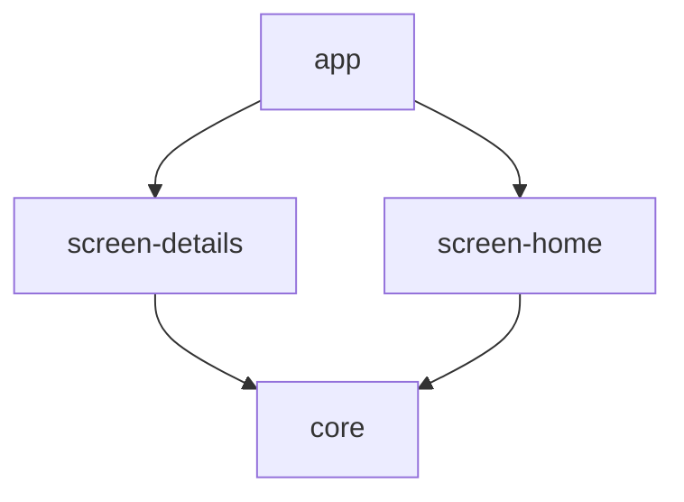

# Description

This sample project gives a basic idea of how you can use Metro in a multi-module, multi-screen app to inject ViewModels into a basic Compose Multiplatform app. This supports both direct injection and assisted injection.

# Module Structure



# Walkthrough

The core module contains a few utilities used throughout:

- A `Clock` interface, just to act as a dummy object which is injected from AppScope and ViewModelScope
- Barebones declarations of the two graphs: `AppGraph` and `ViewModelGraph`
- Composable functions for fetching ViewModels:
  - directly, using `metroViewModel`
  - using the generated assisted factory, using `assistedMetroViewModel`

The two screen modules demonstrate how to declare the ViewModels for each of the two injection cases.

The app module shows how to tie it all together and provide a method of building the a VM graph for the other modules to access.

## Standard ViewModel

### Declaration

```kotlin
@Inject
@ViewModelKey(HomeViewModel::class)
@ContributesIntoMap(ViewModelScope::class)
class HomeViewModel(
  private val clock: Clock,
) : ViewModel() {
  // ...
}
```

### Injection

```kotlin
@Composable
fun HomeScreen(
  viewModel: HomeViewModel = metroViewModel<HomeViewModel>(),
) {
  // ...
}
```

## Assisted ViewModel Factory

### Declaration

```kotlin
@Inject
class DetailsViewModel(@Assisted private val data: String) : ViewModel() {
  // ...

  @AssistedFactory
  @AssistedFactoryKey(Factory::class)
  @ContributesIntoMap(ViewModelScope::class)
  fun interface Factory : ViewModelAssistedFactory {
    fun create(@Assisted data: String): DetailsViewModel
  }
}
```

### Injection

```kotlin
@Composable
fun DetailsScreen(
  data: String,
  viewModel: DetailsViewModel =
    assistedMetroViewModel<DetailsViewModel, DetailsViewModel.Factory> { create(data) },
) {
  // ...
}
```
